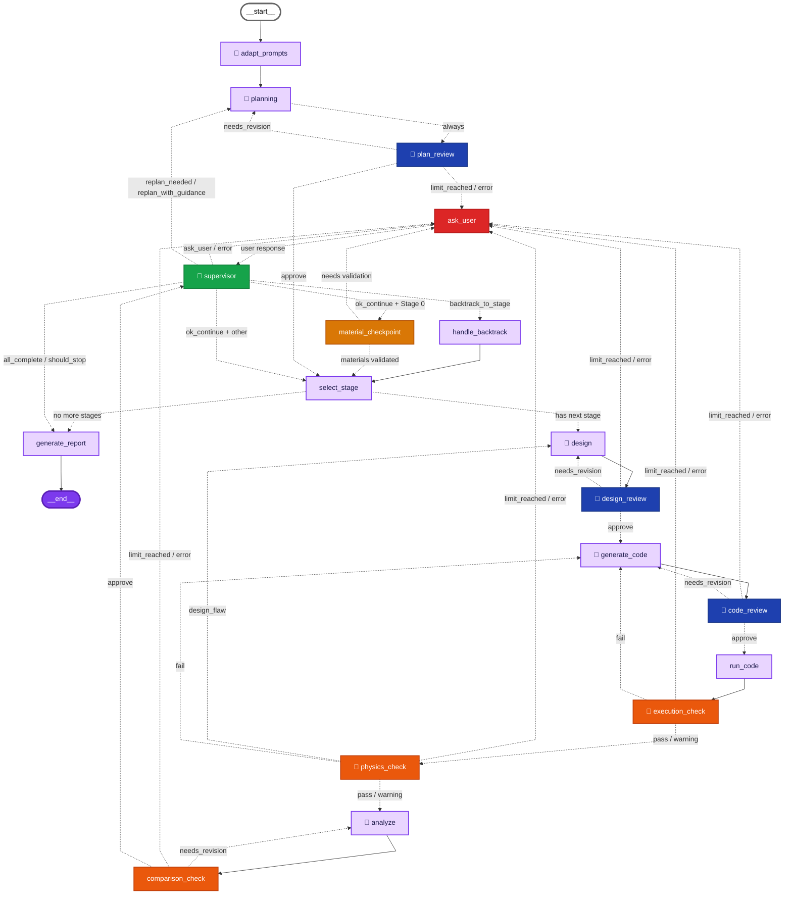

# ReproLab Workflow Graph

This document contains the complete Mermaid representation of the ReproLab workflow graph, **automatically generated** from the LangGraph code.

> **Note**: This diagram is generated deterministically from `src/graph.py` and `src/routing.py`. To regenerate, run:
> ```bash
> python visualize_graph.py
> ```

## Complete Graph Structure (with Edge Labels)



## Node Descriptions

### Core Workflow Nodes

- **adapt_prompts**: Customizes prompts for paper-specific needs
- **planning**: Reads paper and creates staged reproduction plan
- **plan_review**: Reviews reproduction plan before stage execution
- **select_stage**: Selects next stage based on dependencies and validation hierarchy
- **design**: Designs simulation setup for current stage
- **design_review**: Reviews simulation design before code generation
- **generate_code**: Generates Python+Meep simulation code
- **code_review**: Reviews generated code before execution
- **run_code**: Executes the simulation code
- **execution_check**: Validates simulation ran correctly
- **physics_check**: Validates physics (conservation, value ranges)
- **analyze**: Compares results to paper figures
- **comparison_check**: Validates comparison accuracy
- **supervisor**: Makes high-level decisions about workflow progression
- **ask_user**: Pauses workflow to request user input
- **generate_report**: Generates final reproduction report
- **handle_backtrack**: Handles backtracking to previous stages
- **material_checkpoint**: Mandatory checkpoint after Stage 0 (material validation)

## Edge Types

- **Solid arrows (`-->`)**: Direct edges (always taken)
- **Dashed arrows (`-.->`)**: Conditional edges (routed based on state/verdict)
- **Edge labels**: Explain the condition that causes flow to that edge (e.g., "approve", "needs_revision", "pass", "fail")

## Node Color Coding

The diagram uses color-coded nodes to help identify different node types:

- **Blue nodes** (`reviewNode`): Review nodes (plan_review, design_review, code_review)
- **Red nodes** (`userNode`): User interaction nodes (ask_user)
- **Green nodes** (`supervisorNode`): Supervisor node (supervisor)
- **Orange/Yellow nodes** (`checkpointNode`): Checkpoint nodes (material_checkpoint)
- **Orange nodes** (`validationNode`): Validation nodes (execution_check, physics_check, comparison_check)
- **Purple nodes** (`workflowNode`): Core workflow nodes (default color for other nodes)

> **Note**: All colored nodes use high-contrast color schemes (dark backgrounds with white text, or light backgrounds with dark text) to ensure readability and meet accessibility standards.

## LLM Call Indicator

Nodes marked with 🤖 make LLM (Language Model) calls. Nodes without this indicator perform pure logic operations without LLM calls.

> **Note**: LLM nodes are detected automatically by analyzing the source code for calls to `call_agent_with_metrics`.

**Nodes with LLM calls (🤖)**: adapt_prompts, analyze, code_review, design, design_review, execution_check, generate_code, physics_check, plan_review, planning, supervisor

**Nodes without LLM calls**:
- ask_user
- comparison_check
- generate_report
- handle_backtrack
- material_checkpoint
- run_code
- select_stage

## Key Features

- **Three-tier review system**: Plan, Design, and Code each have dedicated reviewers
- **Material checkpoint**: After Stage 0 completes, `material_checkpoint` node routes to `ask_user` for mandatory user confirmation
- **Backtracking support**: `handle_backtrack` node marks target stage as `needs_rerun` and dependent stages as `invalidated`
- **User interaction**: `ask_user` node uses LangGraph interrupts to pause workflow and request user input
- **Supervisor orchestration**: `supervisor` node makes high-level decisions and routes to appropriate next steps
