# ReproLab Workflow Graph

This document contains the complete Mermaid representation of the ReproLab workflow graph, **automatically generated** from the LangGraph code.

> **Note**: This diagram is generated deterministically from `src/graph.py` and `src/routing.py`. To regenerate, run:
> ```bash
> python visualize_graph.py
> ```

## Complete Graph Structure (with Edge Labels)

```mermaid
---
config:
  flowchart:
    curve: linear
---
graph TD;
	__end__([<p>__end__</p>]):::last
	__start__([<p>__start__</p>]):::first
	adapt_prompts["🤖 adapt_prompts"]:::workflowNode
	analyze["🤖 analyze"]:::workflowNode
	ask_user["ask_user"]:::userNode
	code_review["🤖 code_review"]:::reviewNode
	comparison_check["comparison_check"]:::validationNode
	design["🤖 design"]:::workflowNode
	design_review["🤖 design_review"]:::reviewNode
	execution_check["🤖 execution_check"]:::validationNode
	generate_code["🤖 generate_code"]:::workflowNode
	generate_report["🤖 generate_report"]:::workflowNode
	handle_backtrack["handle_backtrack"]:::workflowNode
	material_checkpoint["material_checkpoint"]:::checkpointNode
	physics_check["🤖 physics_check"]:::validationNode
	plan_review["🤖 plan_review"]:::reviewNode
	planning["🤖 planning"]:::workflowNode
	run_code["run_code"]:::workflowNode
	select_stage["select_stage"]:::workflowNode
	supervisor["🤖 supervisor"]:::supervisorNode
	__start__ --> adapt_prompts;
	adapt_prompts --> planning;
	analyze --> comparison_check;
	ask_user -.->|user response| supervisor;
	code_review -.->|limit_reached / error| ask_user;
	code_review -.->|needs_revision| generate_code;
	code_review -.->|approve| run_code;
	comparison_check -.->|needs_revision| analyze;
	comparison_check -.->|limit_reached / error| ask_user;
	comparison_check -.->|approve| supervisor;
	design --> design_review;
	design_review -.->|limit_reached / error| ask_user;
	design_review -.->|needs_revision| design;
	design_review -.->|approve| generate_code;
	execution_check -.->|limit_reached / error| ask_user;
	execution_check -.->|fail| generate_code;
	execution_check -.->|pass / warning| physics_check;
	generate_code --> code_review;
	handle_backtrack --> select_stage;
	material_checkpoint -.->|needs validation| ask_user;
	material_checkpoint -.->|materials validated| select_stage;
	physics_check -.->|pass / warning| analyze;
	physics_check -.->|limit_reached / error| ask_user;
	physics_check -.->|design_flaw| design;
	physics_check -.->|fail| generate_code;
	plan_review -.->|limit_reached / error| ask_user;
	plan_review -.->|needs_revision| planning;
	plan_review -.->|approve| select_stage;
	planning -.->|always| plan_review;
	run_code --> execution_check;
	select_stage -.->|has next stage| design;
	select_stage -.->|no more stages| generate_report;
	supervisor -.-> analyze;
	supervisor -.->|ask_user / error| ask_user;
	supervisor -.-> code_review;
	supervisor -.-> design;
	supervisor -.-> design_review;
	supervisor -.-> generate_code;
	supervisor -.->|all_complete / should_stop| generate_report;
	supervisor -.->|backtrack_to_stage| handle_backtrack;
	supervisor -.->|ok_continue + Stage 0| material_checkpoint;
	supervisor -.-> plan_review;
	supervisor -.->|replan_needed / replan_with_guidance| planning;
	supervisor -.->|ok_continue + other| select_stage;
	generate_report --> __end__;
	classDef default fill:#e9d5ff,stroke:#7c3aed,stroke-width:2px,color:#1e1b4b
	classDef workflowNode fill:#e9d5ff,stroke:#7c3aed,stroke-width:2px,color:#1e1b4b
	classDef reviewNode fill:#1e40af,stroke:#1e3a8a,stroke-width:2px,color:#ffffff
	classDef userNode fill:#dc2626,stroke:#b91c1c,stroke-width:2px,color:#ffffff
	classDef supervisorNode fill:#16a34a,stroke:#15803d,stroke-width:2px,color:#ffffff
	classDef checkpointNode fill:#d97706,stroke:#b45309,stroke-width:2px,color:#ffffff
	classDef validationNode fill:#ea580c,stroke:#c2410c,stroke-width:2px,color:#ffffff
	classDef first fill-opacity:0,stroke:#666666,stroke-width:3px,color:#000000
	classDef last fill:#7c3aed,stroke:#5b21b6,stroke-width:3px,color:#ffffff
```



## Node Descriptions

### Core Workflow Nodes

- **adapt_prompts**: Customizes prompts for paper-specific needs
- **planning**: Reads paper and creates staged reproduction plan
- **plan_review**: Reviews reproduction plan before stage execution
- **select_stage**: Selects next stage based on dependencies and validation hierarchy
- **design**: Designs simulation setup for current stage
- **design_review**: Reviews simulation design before code generation
- **generate_code**: Generates Python+Meep simulation code
- **code_review**: Reviews generated code before execution
- **run_code**: Executes the simulation code
- **execution_check**: Validates simulation ran correctly
- **physics_check**: Validates physics (conservation, value ranges)
- **analyze**: Compares results to paper figures
- **comparison_check**: Validates comparison accuracy
- **supervisor**: Makes high-level decisions about workflow progression
- **ask_user**: Pauses workflow to request user input
- **generate_report**: Generates final reproduction report
- **handle_backtrack**: Handles backtracking to previous stages
- **material_checkpoint**: Mandatory checkpoint after Stage 0 (material validation)

## Edge Types

- **Solid arrows (`-->`)**: Direct edges (always taken)
- **Dashed arrows (`-.->`)**: Conditional edges (routed based on state/verdict)
- **Edge labels**: Explain the condition that causes flow to that edge (e.g., "approve", "needs_revision", "pass", "fail")

## Node Color Coding

The diagram uses color-coded nodes to help identify different node types:

- **Blue nodes** (`reviewNode`): Review nodes (plan_review, design_review, code_review)
- **Red nodes** (`userNode`): User interaction nodes (ask_user)
- **Green nodes** (`supervisorNode`): Supervisor node (supervisor)
- **Orange/Yellow nodes** (`checkpointNode`): Checkpoint nodes (material_checkpoint)
- **Orange nodes** (`validationNode`): Validation nodes (execution_check, physics_check, comparison_check)
- **Purple nodes** (`workflowNode`): Core workflow nodes (default color for other nodes)

> **Note**: All colored nodes use high-contrast color schemes (dark backgrounds with white text, or light backgrounds with dark text) to ensure readability and meet accessibility standards.

## LLM Call Indicator

Nodes marked with 🤖 make LLM (Language Model) calls. Nodes without this indicator perform pure logic operations without LLM calls.

> **Note**: LLM nodes are detected automatically by analyzing the source code for calls to `call_agent_with_metrics`.

**Nodes with LLM calls (🤖)**: adapt_prompts, analyze, code_review, design, design_review, execution_check, generate_code, generate_report, physics_check, plan_review, planning, supervisor

**Nodes without LLM calls**:
- ask_user
- comparison_check
- handle_backtrack
- material_checkpoint
- run_code
- select_stage

## Key Features

- **Three-tier review system**: Plan, Design, and Code each have dedicated reviewers
- **Material checkpoint**: After Stage 0 completes, `material_checkpoint` node routes to `ask_user` for mandatory user confirmation
- **Backtracking support**: `handle_backtrack` node marks target stage as `needs_rerun` and dependent stages as `invalidated`
- **User interaction**: `ask_user` node uses LangGraph interrupts to pause workflow and request user input
- **Supervisor orchestration**: `supervisor` node makes high-level decisions and routes to appropriate next steps

## Routing Mechanism

### Single Mechanism: `ask_user_trigger`

The workflow uses a single state field `ask_user_trigger` to control routing to user interaction:

1. **Setting the trigger**: When a node needs user input (error limit reached, LLM escalation, etc.), it sets `ask_user_trigger` to a value like `"code_review_limit"` or `"reviewer_escalation"`

2. **Routing check**: All routers are wrapped with `with_trigger_check` which checks this field FIRST before any other routing logic. If set, the router returns `"ask_user"`

3. **Node skipping**: Nodes decorated with `@with_context_check` skip execution if `ask_user_trigger` is set, preserving the trigger for the router to handle

4. **Trigger clearing**: The supervisor clears `ask_user_trigger` after successfully handling the user response

### Why This Design?

This unified approach ensures:
- **Consistency**: All routing decisions check the same field
- **No stuck states**: The trigger is always handled by routing to `ask_user`
- **Predictable flow**: User interaction is always processed through `ask_user → supervisor`

### Trigger Types

| Trigger | Source | Description |
|---------|--------|-------------|
| `code_review_limit` | code_reviewer | Code revision limit reached |
| `design_review_limit` | design_reviewer | Design revision limit reached |
| `replan_limit` | supervisor/plan_reviewer | Replan limit reached |
| `reviewer_escalation` | any reviewer | LLM explicitly asks for user help |
| `context_overflow` | context check | LLM context limit exceeded |
| `material_checkpoint` | material_checkpoint | Mandatory material validation |
| `backtrack_limit` | handle_backtrack | Backtrack limit exceeded |
| `execution_failure_limit` | execution_check | Execution failure limit reached |
| `physics_failure_limit` | physics_check | Physics check failure limit reached |
| `analysis_limit` | comparison_check | Analysis revision limit reached |
| `missing_stage_id` | various | Stage ID missing (workflow error) |
| `llm_error` | various | LLM API call failed |
